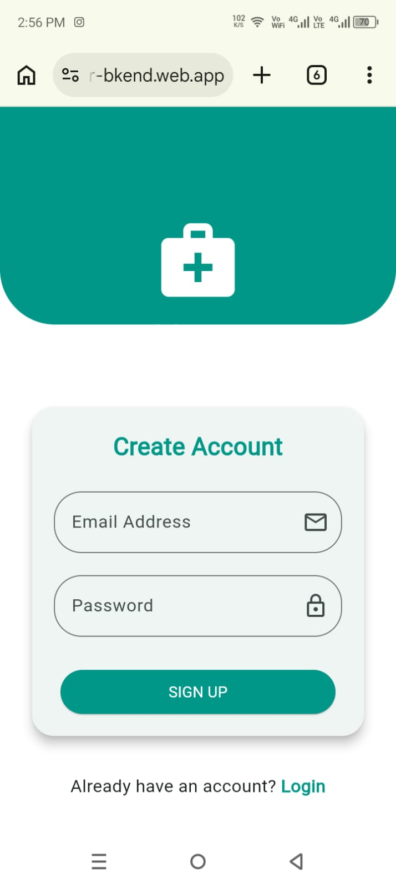
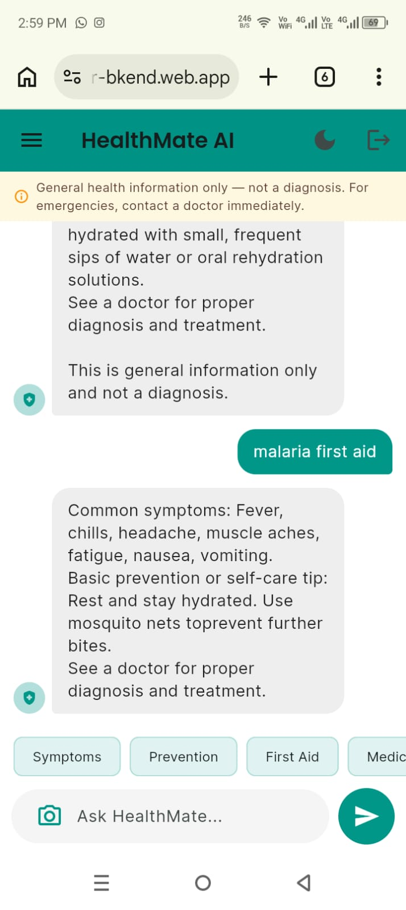
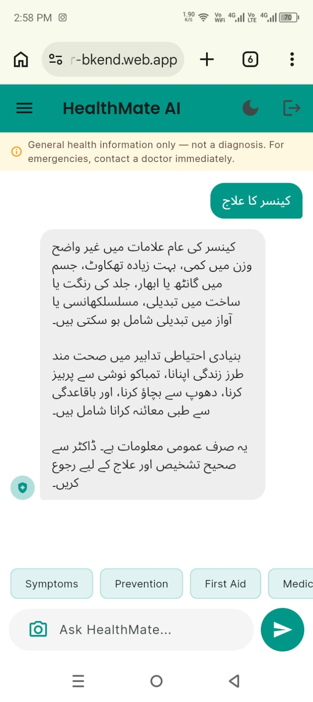

# HealthMate AI

A bilingual (English + Urdu) health information chatbot built with Flutter, Firebase, and Google Gemini — designed for users who are more comfortable asking health questions in Urdu, or who don't have quick access to a doctor for general health guidance.

## Problem It Solves

Many people — especially in Urdu-speaking communities with limited access to quick medical guidance — turn to unreliable sources (random web searches, word of mouth) for basic health questions like symptoms, prevention, and first aid. HealthMate AI gives fast, consistent, bilingual health information in a simple chat interface, while always directing users to a real doctor for diagnosis and treatment.

**Who it's for:** Anyone needing quick, general health information in English or Urdu — students, families, and individuals without immediate access to a doctor for basic questions.

## Live URL

🔗 **[https://fir-bkend.web.app](https://fir-bkend.web.app)**

## Features

- 🔐 Email/password authentication (Firebase Auth)
- 💬 Real-time, streaming AI chat for health-related questions
- 🌐 Bilingual support — responds in English or Urdu depending on the language used
- 🖼️ Image upload — ask about a visible symptom or condition via photo
- 📜 Persistent chat history (Cloud Firestore) — create, reopen, and delete past chats
- 🌗 Light/Dark theme toggle (fully theme-aware, including the splash screen)
- ⚠️ Persistent, always-visible safety disclaimer — general information only, not a diagnosis
- 🚫 Strict domain guardrail — the AI declines to answer non-health questions
- ⚡ Quick-topic chips (Symptoms, Prevention, First Aid, Medication) for fast, one-tap questions
- 💬 Empty-state guidance for new chats, and a live "typing" indicator while the AI responds
- 🛟 Graceful error handling — if the AI service is misconfigured, the app shows a clear in-chat message instead of crashing

## The AI Feature

**What it does:** Every user message is sent to Google's Gemini API (`gemini-2.5-flash`) along with a system instruction that restricts it strictly to health topics, enforces a consistent response structure (symptoms → prevention/self-care tip → "see a doctor" reminder), redirects emergency-sounding questions to urgent care guidance, and responds in whichever language (English or Urdu) the user asked in.

**System prompt used:**
```
CORE IDENTITY: You are HealthMate AI 🏥, a bilingual (English/Urdu) health information assistant.
STRICT POLICIES:
1. Only discuss health, medical conditions, anatomy, first aid, drugs, symptoms, and lifestyle biology.
2. If asked about anything outside medicine, refuse exactly with: 'I am designed only for medical and health inquiries. Please ask a health-related question.'
3. For every valid symptom/condition question, ALWAYS respond in this exact structure, concise:
   - Common symptoms (short list)
   - Basic prevention or self-care tip (if applicable)
   - A closing line: 'See a doctor for proper diagnosis and treatment.'
   Never answer with only 'see a doctor' alone — always include the symptom info first.
4. If the question describes a possible emergency (severe chest pain, difficulty breathing, stroke signs,
suicidal thoughts, overdose, heavy bleeding), skip the structure above and respond only with urgent guidance
to contact emergency services or a doctor immediately.
5. Respond in the same language the user asked in (English or Urdu).
6. No bold ** or # markdown symbols.
7. This is general information only, not a diagnosis — make that clear whenever the answer could be mistaken
for medical certainty.
```

## Tools, Services & Models Used

- **Frontend:** Flutter (web + mobile)
- **Backend:** Firebase (Authentication, Cloud Firestore)
- **AI Model:** Google Gemini API (`gemini-2.5-flash`)
- **Packages:** `google_generative_ai`, `firebase_auth`, `cloud_firestore`, `flutter_dotenv`, `image_picker`, `uuid`, `google_fonts`
- **Hosting:** Firebase Hosting

## Screenshots

| Login | Chat (English) | Chat (Urdu) |
|---|---|---|
|  |  |  |

## How to Run Locally

1. **Clone the repo:**
   ```bash
   git clone <your-repo-url>
   cd medicalchatbot
   ```

2. **Install dependencies:**
   ```bash
   flutter pub get
   ```

3. **Set up your Gemini API key:**
   Create a file named `env_config.txt` in the project root:
   ```
   GEMINI_API_KEY=your_own_gemini_api_key_here
   ```
   Get a free key at [Google AI Studio](https://aistudio.google.com/apikey).

   > Note: a plain `.txt`-style filename (not `.env`) is used deliberately, since Firebase Hosting's default `ignore` rules exclude dotfiles (`**/.*`) from deployment — using a non-dotfile name avoids the key silently failing to reach the live site.

4. **Set up Firebase for your own project:**
   ```bash
   dart pub global activate flutterfire_cli
   flutterfire configure
   ```
   Select or create your own Firebase project, and make sure **web** is included in the platform selection. This generates `lib/firebase_options.dart`.

5. **Enable Email/Password Authentication and Firestore** in your Firebase project console.

6. **Run the app:**
   ```bash
   flutter run -d chrome
   ```

## Deployment

```bash
flutter build web
firebase deploy --only hosting
```
Deployed via **Firebase Hosting**. Live at: **[https://fir-bkend.web.app](https://fir-bkend.web.app)**
